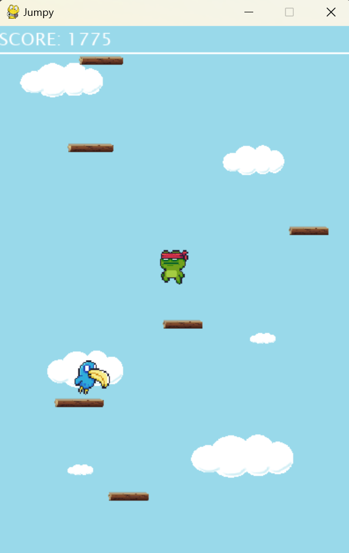

# Jumpy

## Overview

This project is a 2D platformer game built using Pygame, a popular Python library for creating games. The game features a player character that can move left, right, and jump across platforms. Enemies move across the screen, and the player's goal is to avoid them while navigating the platforms.

## Features

- **Player Movement**: The player can move left, right, and jump.
- **Platforms**: Platforms are placed at different heights, and the player can land on them.
- **Enemies**: Enemies move horizontally across the screen. The player must avoid them to survive.
- **Scrolling**: The game screen scrolls as the player moves up the platforms.

## Preview

## Requirements

- Python 3.x
- Pygame

## Setup

1. **Install Python**: Make sure Python 3.x is installed on your system.
2. **Install Pygame**: Install Pygame using pip:
   ```bash
   pip install pygame
   ```

3. **Clone the Repository**: Clone this repository to your local machine.
   ```bash
   git clone https://github.com/yourusername/your-repository.git
   ```

4. **Run the Game**: Navigate to the directory where you cloned the repository and run the game.
   ```bash
   python main_game.py
   ```

## File Structure

- **`background.py`**: Handles the background rendering.
- **`enemy.py`**: Defines the Enemy class and handles enemy behavior.
- **`game_platform.py`**: Defines platforms that the player can jump on.
- **`main_game.py`**: The main entry point of the game, handling game loop and overall logic.
- **`player.py`**: Defines the Player class and handles player movement and interaction.
- **`settings.py`**: Contains game settings like screen width, height, and other constants.
- **`sprite_sheet.py`**: Handles sprite sheet loading and frame extraction.

## How to Play

- Use the **A** key to move left.
- Use the **D** key to move right.
- Use the **Space** key to restart.
- Avoid enemies and move up the platforms to survive as long as possible.
